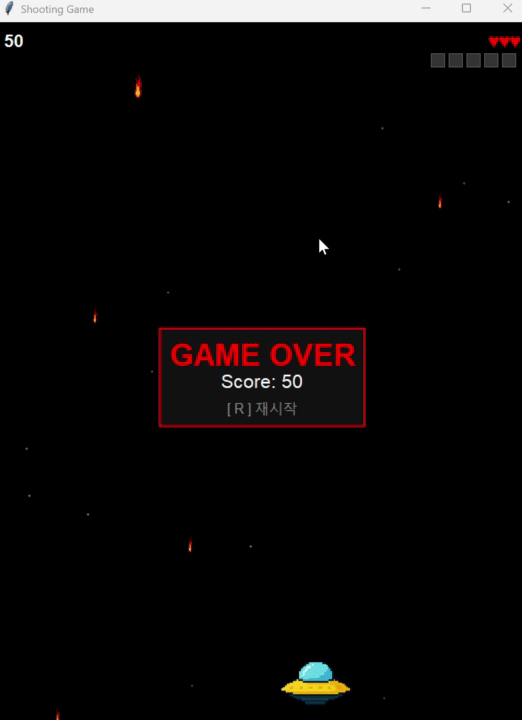

우주선을 좌우 방향키로 옮기면서 내려오는 운석(적)들을 스페이스 바를 이용해 총알을 쏴 제거한다. 
큰 운석은 3번의 총알이 필요하고 작은 운석은 1번의 총알이 필요하다. 
단계가 5개씩 올라갈 때마다 내려오는 적의 수가 늘어나며 큰 운석을 제거 했을 때 파란 원(포션)이 나타난다. 
포션은 총 5개까지 획득할 수 있으며 우주선에 운석이 닿을 때마다 하나씩 사라진다. 
총 목숨은 3개이다. 
단, 운석이 우주선에 닿지 않고 바닥에 곧바로 닿을시 바로 게임오버 된다. 
게임오버 화면에 총 점수가 나오고 R키를 누를시 재시작할 수 있다. 

